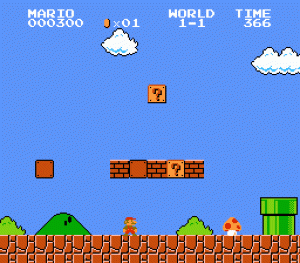
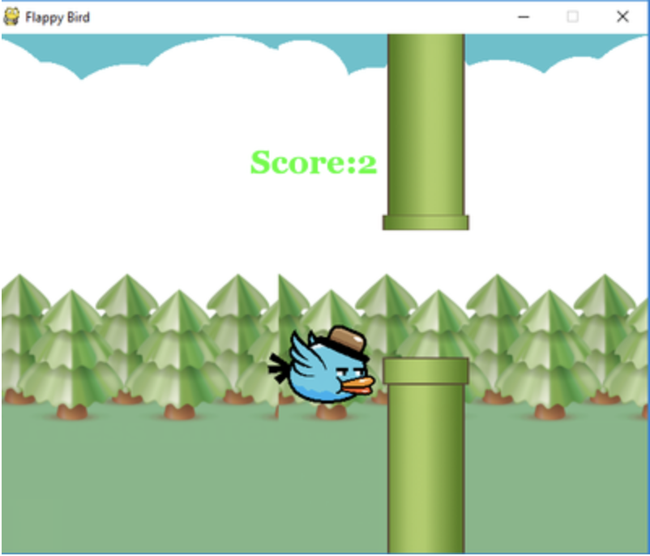

# Project 4 [Group (3-4 people)]

#### Important Dates
* Project Start
  * **Thursday October 29, 2020**
* Project Proposal Due (Upload to Canvas)
  * **Thursday November 12, 2020 (23:59)**
  * *About 2 pages*
* Project Progress Report Due
  * **Thursday November 26, 2020 (23:59)**
  * *About 5 pages*
* Final Project Report Due
  * **Tuesday December 8, 2020 (23:59)**
  * *About 10 pages*
  * *Code and trained model*
  * *Demo (Optional)*
  * *Self-and-cross evaluation form*
* Poster Session (on Zoom)
  * **Thursday December 10, 2020**

#### Total Points
* 100 (One Hundred)

## Project Titles
| Team | Title|
| :---: | :---: |
|1|Benchmarking Agents Across Diverse Tasks |
|2|Football with Manchester|
|3|Deep Reinforcement Learning for Traffic Flow Optimization|
|4|Generalized models for robotic tasks |
|5|Tactical Decision-Making for Autonomous Driving |
|6|Super Mario Bros |
|7|Robot Navigation in Dynamic Environments using Deep Reinforcement Learning |
|8|Autonomous Driving Simulation with Dynamic Obstacle Avoidance |
|9|A Comparative Study of Jitter-Mitigating Methods for Deep Reinforcement Learning |

# Final Poster Session
Final Poster Session will be held in Zoom breakout rooms. Each breakout room will have **3** teams, when one team is presenting, other teams are assigned as audients/judges. Also, the poster session will have invited guests (students and faculty from not
only WPI).
## Zoom Link
Please find the class zoom link in Canvas (for registered students) or the invitation email you received (for guests).

## Session Schedule
**Date** : Dec 10, 2020
| Time | Breakroom 1 | Breakroom 2 | Breakroom 3| 
|---|---|---|---|
|6:00pm - 6:35pm|Team1|Team4|Team7|
|6:40pm - 7:15pm|Team2|Team5|Team8|
|7:20pm - 7:55pm|Team3|Team6|Team9|

**8pm-8:50pm Free discussion in the main meeting room; leave any time**

## Details
#### After joining the main session, to start: 

1. Change your name as follows 
   - Guests: Guest-School-Name, e.g., Guest-WPI-John
   - Class students: Team-ID-Name, e.g., Team-1-John
   - TAs: TA-Name

2. Send a message to ***TA-Yingxue*** to request to join a poster breakout room.

#### To switch to a new breakout room:

1. Leave a breakout room to the main session, 
2. Send a request to ***TA-Yingxue*** in the main session

***Feedback here: https://forms.gle/AVNdVfBgqZYySYcm7***

## Project Ideas
### Games

* Play Super Mario Bros with Reinforcement Learning
  * Game environment
    * [gym-super-mario-bros 7.3.0](https://pypi.org/project/gym-super-mario-bros/)
       * Current reward function is moving as fast as possible
  * Research question
    * Define your reward function, such as getting higher score, eating more coins, letting Marios be "tall" or "fireball", etc.
    * Comparison among different deep reinforcement learning algorithms, such as DQN, PPO, A3C, etc.
    * ...
  * Github solutions 
    * [Super-mario-bros-A3C-pytorch](https://github.com/vietnguyen1991/Super-mario-bros-A3C-pytorch)
    * [Super-mario-neat](https://github.com/vivek3141/super-mario-neat)
    * [A3C-super-mario-pytorch](https://github.com/ArvindSoma/a3c-super-mario-pytorch)

* Play Other Games from [PyGame](https://www.pygame.org)
  * [Flappybird](https://www.pygame.org/project/3448)
  * [Dark Tetris](https://www.pygame.org/project/4297)

### Research Related
* Inverse Reinforcement Learning
  * Use taxi trajectory data to inversely learn their passenger-seeking decision-making strategies
  * [Urban Data](https://www.cs.rutgers.edu/~dz220/data.html)
  * [MDP trajectory data](http://urban.cs.wpi.edu/DLCTD/download.html)
  
* Other Cool Ideas
  * [Using Intrinsic Motivation to Solve Robotic Tasks with Sparse Rewards](https://jmichaux.github.io/intrinsic-motivation/) 
  * [Combining PPo and Evolutionary Strategies for Better Policy Optimization](http://cs229.stanford.edu/proj2018/poster/251.pdf)
  * [Apply Reinforcement Learning in Ads Bidding Optimization](http://cs229.stanford.edu/proj2018/poster/256.pdf)

* [Magenta:](https://github.com/tensorflow/magenta) (Tensorflow based)
   * Magenta is a research project exploring the role of machine learning in the process of creating art and music. Primarily this involves developing new deep learning and reinforcement learning algorithms for generating songs, images, drawings, and other materials.  
   

    
   

   It is also an exploration in building smart tools and interfaces that allow artists and musicians to extend (not replace!) their processes using these models. Go spread your wings, create your unique content for Instagram or Soundcloud and become an influencer.
   
* You can participate an open AI/RL competition
  * [MineRL competition 2019](http://minerl.io/competition/): A competition on sample-effiecient reinforcement learning using human priors.
  * [ICLR Challenge](https://www.cs.mcgill.ca/~jpineau/ICLR2019-ReproducibilityChallenge.html): Reproduce recent results in a RL paper. 
  * [Kaggle](https://www.kaggle.com/): An online machine learning competition website.
  
* You may also consider browsing through the RL publications listed below, to get more ideas.
  * [RLDM](http://rldm.org/): Multi-disciplinary Conference on Reinforcement Learning and Decision Making
  * [AAMAS](http://www.aamas-conference.org/): International Conference on Autonomous Agents and MultiAgent Systems
  * [NIPS](https://neurips.cc/): Neural Information Processing Systems
  * [ICML](https://icml.cc/): International Conference on Machine Learning
  * [ICLR](https://iclr.cc/): International Conference on Representations
  * [arXiv](https://arxiv.org/list/cs.CL/recent): e-prints archive

## Deliverables
* STAGE 1: Project Proposal.
Each group will turn in a typed proposal document (about 2 pages) defining the finalized project. You should have thought about your proposed work, and possibly tried to solve some initial part of it. Make sure to have dug in enough to understand the feasibility of your proposed direction, and/or to have looked at the necessary background knowledge and skills needed to pursue the project. This proposal should explain the proposed work to be done. You should also list relevant environment (tools) you have set up or papers you have read in order to succeed to complete the project. Do provide an expected schedule for your planned completion, including a list of tasks to be undertaken week by week, and the deliverables for the end of the course. 

* STAGE 2: Project Progress.
This progress report should clearly state the current status of the project. This report must be typed. Typically it is about 5 pages long. By this time, I would expect you to be already half way towards completing your project. Teams routinely loose points for this stage, if they have not succeeded to make sufficient progress. I would expect you to have conducted all necessary background work including establishing a bibliography and reading relevant manuals and literature, installing and testing all necessary software, resolving specific design issues, and refining the project plan or possibly re-directing the effort based on your background studies. Also, there needs to be a clear plan of what will be accomplished by the end of the project. You must develop a precise schedule and task list for the remainder of the project. 

* Stage 3: Final Project.
Finally, the complete project is delivered. You are expected to produce and submit a professional report on your project, complete with a clear motivation, full description with examples, and careful evaluation of the effectiveness of the solution. In addition, the presentation and demonstration of your solution, as appropriate, will be done in class by each team. We'll determine the exact time allowed per project later. See below to learn about what aspects should be stressed in this presentation. 
This presentation must be supplemented with a final project report due at the same time. This report should be a well-written technical report describing your project. It is fine and in fact likely that this report will be a direct extension of your progress report. Depending on the nature of your project, it will need to contain a detailed description of your data set, of your system, key technologies used, experimental charts, sample runs, a detailed analysis of the results. The report typically is about 10 pages.

## Grading
* **PDF Report (40 points)**
* **Presentation (30 points)**
* **Code (30 points)**

**Project Grading in General**

The final grade of the team project (which may not necessarily be the same for each member of the team) will be based on :
* the difficulty of the project you have chosen to work on, and the effort you have put into formulating your problem and identifying relevant techniques to solve your problems,
* your solution approach and techniques utilized and the quality and effort of execution,
* the oral project presentation (covering the problem your group tackled, your solution approach, and your results at the end of the course),
* the written documentation of your project in the form of a report (which you will make accessible to other students in the class),
* the demonstration of your system (including successful example runs), as applicable and
* the understanding of each team member of his or her part of the project, as well as of the overall group product.
